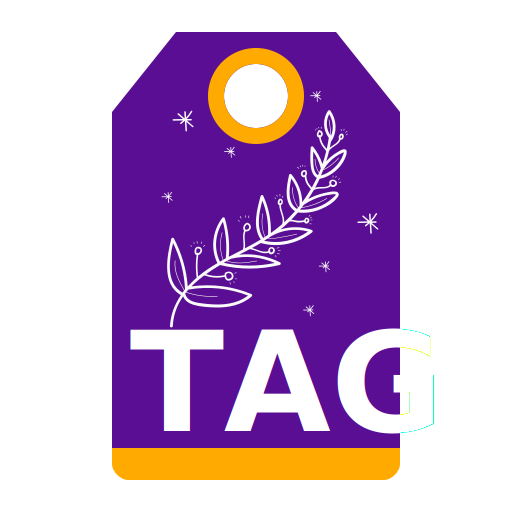

# tag - File Tagger

version 0.0.1

This is a working but infant little program.  For details
use tag --help for information.  Or read the code (the help
is toward the top).

*Important: This is for tagging* `[like this]` *in filenames, not the metadata in a file.*


## Build

If you have nim installed, simply clone and run `make`.

Also, `make clean` does the obvious and `make test` runs a (quick and dirty) test suite.

## Example of Usage

To add a tag, use `+tagname`.  To remove one, use `-tagname`.  By default, tags are added at the end of a file, before the extension.

Like Imagemagick or `find`, the commandline is not parsed for options and then arguments, but instead each term is considered in order.  This means that tag

```
$ ls -1
File1 
File2 [hello].txt
File3 [hello][moon]
$ tag File1 +world "File2 [hello]" -moon "File3 [hello][moon]"
╭ File2 [hello].txt
╰ File2 [hello][world].txt
╭ File3 [hello][moon]
╰ File3 [hello][world]
$ ls -1
File1
File2 [hello][world].txt
File3 [hello][world]
```


## Warning

Be warned, this is my first nim code, and I wrote this in part
to learn nim.  I am absolutely sure this is the kind of thing
where I will return, less ignorant, and be merciless in my 
review of my current (former?) self's choices.  

That's partially why it is a monolithic block with some iffy 
structure.  I learned as I went.  But the code does work and 
I have some ideas on extending it.  

In short: this is not good code to learn nim from.


# TODO

TODOs are phrased affirmatively.  When they are true, they are moved to the Changelog.

- [ ] If a file has a numerical suffix, a la `(1).txt`, tags are placed prior to it.
- [ ] Templates can be specified in a config file.  %name has been reserved for this purpose
- [ ] When -- is used, all following arguments are processed as filenames, which allows files starting with -, +, or %.
- [ ] Templates may have programmatic values, like YYYY-dd-mm or similar.
- [ ] A manpage is available.
- [ ] --force allows overwrite.
- [ ] --nodup allows overwrite iff both files are identical.
- [ ] --dry-run shows changes but does not actually rename files.


# Changelog

## 2022-11-20
- Logo and Icon created (per my personal standards).
- Makefile and testing framework set up.
- `--help` shows basic help.
- `--quiet` silences normal output. Probably not the best method for options.
- Initial code, works and handles basic errors.